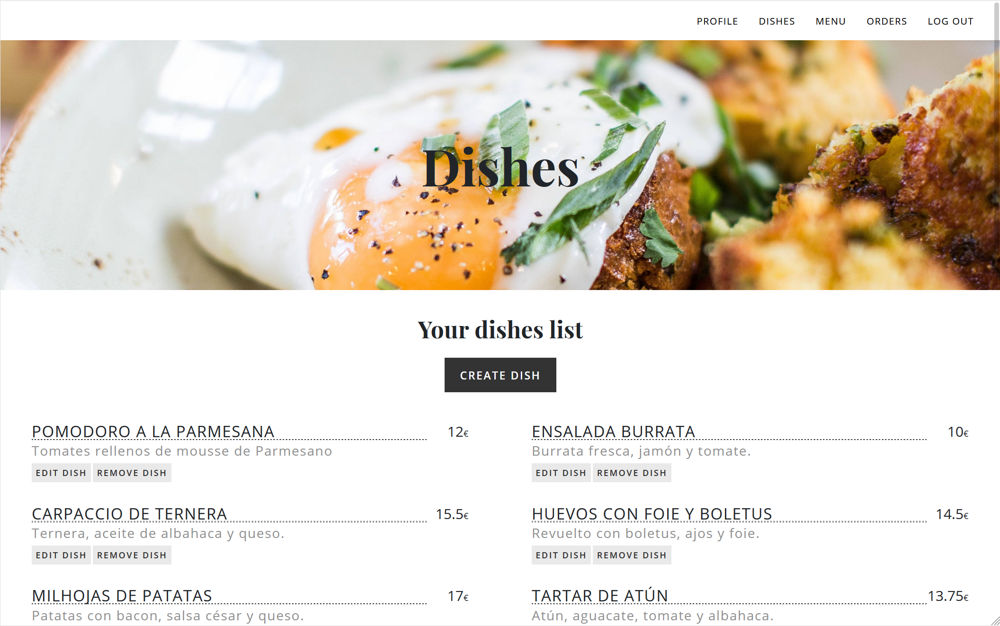

## At Once

## Description

At Once is an app for two types of users: restaurants and clients. Restaurants will be able to introduce their dishes and menu in order to show them to their customers online. Clients, on the other hand, will be able to look at the menu through a link and order directly from it. Their orders will be sent to the restaurant  dashboard and they will not need to interact with each other. This will be really useful to avoid unnecessary human contact due to the current situation.

## User Stories

**sign up**: As a user I want to sign up in order to create an account

**log in**: As a user I want to have access to my account

**log out**: As a user I want to be able log out from the app so that I can make sure no one will access to my account

**dashboard-restaurant:** As a restaurant user I want to have access to all the options for create dishes and menu and manage all the orders

**restaurant-searcher**: As a client user I want to be able to select the restaurant where I am going to eat

**dishes**: As a restaurant user I want to be able to create a list of dishes, and edit and delete them

**menu**: As a restaurant user I want to be able to create a menu to offer

**orders**: As a restaurant user I want to be able to have a list of all my clients orders and manage them by deleting the served ones

**menu-detail**: As a client user I want to be able to see the menu, to select among all the dishes and to make my order

**order-summary**: As a client user I want to be able to see the summary of my order

## Server Routes

| **Method** | **Route**                                 | **Description**                                              | Request - Body                                               |
| ---------- | ----------------------------------------- | ------------------------------------------------------------ | ------------------------------------------------------------ |
| `GET`      | `/`                                       | Main page route. Renders home `index` view.                  |                                                              |
| `GET`      | `/login`                                  | Renders `login` form view.                                   |                                                              |
| `POST`     | `/login`                                  | Sends Login form data to the server.                         | { email, password}                                           |
| `GET`      | `/signup`                                 | Renders `signup` form view.                                  |                                                              |
| `POST`     | `/signup`                                 | Sends Sign Up info to the server and creates user in the DB. User can choose if it's a restaurant or a client. | {username, email, password, isRestaurant }                   |
| `GET`      | `/logout`                                 | Logs user out of the page. Redirect to the `home`.           |                                                              |
| `GET`      | `/restaurant/dashboard-restaurant`        | Private route. Renders `dashboard-restaurant` view.          |                                                              |
| `GET`      | `/restaurant/dishes`                      | Private route. Renders `dishes` view. The user can see all the dishes he has created. |                                                              |
| `POST`     | `/restaurant/dishes`                      | Private route. Sends create-dish info to server and updates dish in DB. Redirects to `dishes` view. | { name, description, characteristics, allergies, category, price, user, restaurant } |
| `GET`      | `/restaurant/dishes/edit/:id`             | Renders `edit-dish`form on the same view.                    |                                                              |
| `POST`     | ``/restaurant/dishes/edit/:id``           | Private route. Sends edited dishes to server and updates them in DB. | { name, description, characteristics, allergies, category, price} |
| `POST`     | `/restaurant/dishes/remove/:id`           | Private route. Delete an existing dish. Redirects to `dishes` view. |                                                              |
| `GET`      | `/restaurant/restaurant-profile`          | Renders `restaurant-profile` view.                           |                                                              |
| `POST`     | `/restaurant/restaurant-profile`          | Private route.  Allows a restaurant to fill in a form to create a new `dish` and create a new one in DB | {name, description, contactInfo (adress, phone, email, website), imgPath} |
| `POST`     | `/restaurant/restaurant-profile-edit/:id` | Private route. Sends edited restaurant profile to server and updates them in DB. | {name, description, contactInfo (adress, phone, email, website), imgPath} |
| `GET`      | `/restaurant/menu`                        | Private route. Renders `menu`view. The user can see the menu he has created. |                                                              |
| `GET`      | `/restaurant/menu-create`                 | Private route. Renders `menu-create`view. The user can see the menu-edit form to create a new menu. |                                                              |
| `POST`     | `/restaurant/menu`                        | Private route.  Allows a restaurant to fill in a form to create a new `menu`and create a new one in DB. | {name, dishes, user, restaurant}                             |
| `GET`      | `/restaurant/menu-edit/:id`               | Private route. Renders `menu-edit`view. The user can see the menu-edit form to update the menu he has created. |                                                              |
| `POST`     | `/restaurant/menu-edit/edit/:id`          | Private route.  Allows a restaurant to fill in a form to edit the `menu` he has create and update it and save it to DB. | {name, dishes}                                               |
| `POST`     | `/restaurant/menu/remove/:id`             | Private route. Delete an existing menu. Redirects to `menu`view. |                                                              |
| `GET`      | `/restaurant/orders`                      | Private route. Renders `orders`view. The user can check all his orders. |                                                              |
| `POST`     | `/restaurant/orders/remove/:id`           | Private route. Delete an existing order. Redirects to `orders`view. |                                                              |
| `POST`     | `/restaurant/order-summary/:id/update`    | Private route. User can update his orders by deleting them when finished. |                                                              |
| `GET`      | `/client/dashboard-client`                | Private route. User can select the restaurant he is in.      |                                                              |
| `GET`      | `/client/carte-detail/:id`                | Private route. User can check the restaurant current menu.   |                                                              |
| `POST`     | `/client/carta-detail`                    | Private route. User can choose the dishes he wants to order. |                                                              |
| `POST`     | `/client/order-summary/:id`               | Private route. The user can check and confirm the order.     | {table, price, dishes}                                       |
| `GET`      | `/client/order-summary/:id`               | Private route. Renders `order-summary`.                      |                                                              |

## Wireframes

## Models

**User model**

{

  username: String,

  email: String,

  password: String,

  isRestaurant: { type: Boolean, default:true }

}

**Restaurant model**

{

  name: String,

  description: String,

  contactInfo: {

​      address: String,

​      phone: Number,

​      email: String,

​      website: String

  },

  imgPath: String,

  //imgName: String alt descripció

  user: { type: Schema.Types.ObjectId, ref: 'User', unique: true }

}

**Dish model**

{

  name: String,

  description: String,

  characteristics: Array,

  allergies: Array,

  category: String,

  price: Number,

  user: { type: Schema.Types.ObjectId, ref: 'User' },

  restaurant: { type: Schema.Types.ObjectId, ref: 'Restaurant' }

}

**Menu model** 

{

  name: String,

  dishes: [{type: Schema.Types.ObjectId, ref: 'Dish'}],

  user: { type: Schema.Types.ObjectId, ref: 'User', unique: true },

  restaurant: { type: Schema.Types.ObjectId, ref: 'Restaurant', unique: true}

}

**Client order model**

{

  table: Number,

  price: Number,

  dishes: [{type: Schema.Types.ObjectId, ref: 'Dish'}],

  user: { type: Schema.Types.ObjectId, ref: 'User'},

  restaurant: { type: Schema.Types.ObjectId, ref: 'Restaurant'}

}

## MPV

Sign up

Log in

Log out

2 Models

1 relation between models

CRUD

Responsive design

## Backlog

Add geolocation in order to detect the restaurant automatically 

Add the option of booking

Add favorites

## Links

#### Git

https://github.com/marcurto/Project_2

https://projecte2ih.herokuapp.com/

#### Slides

https://docs.google.com/presentation/d/1jJf5hz56tzwX5mdPWIxUwtXa9800zPfYH6A-XFH8S2k/edit#slide=id.g9f70d3b4be_0_6

#### Trello

[https://trello.com/b/VRmnqEE8/organitzaci%C3%B3-projecte-2](https://trello.com/b/VRmnqEE8/organització-projecte-2)

## 