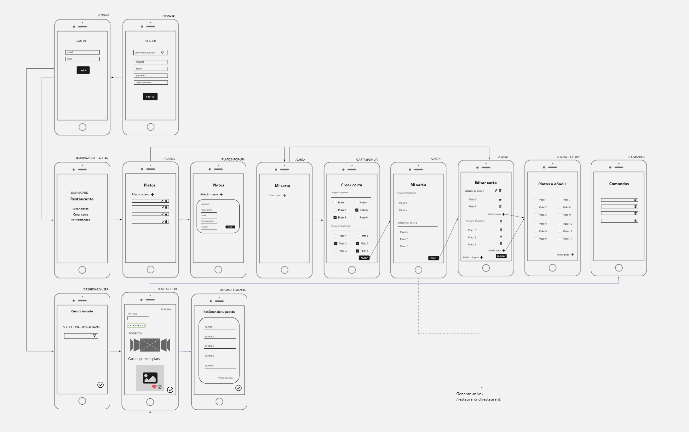

## Description

At Once is an app for two types of users: restaurants and clients. Restaurants will be able to introduce their dishes and menu in order to show them to their customers online. Clients, on the other hand, will be able to look at the menu through a link and order directly from it. Their orders will be sent to the restaurant  dashboard and they will not need to interact with each other. This will be really useful to avoid unnecessary human contact due to the current situation.

## User Stories

**sign up**: As a user I want to sign up in order to create an account

**log in**: As a user I want to have access to my account

**log out**: As a user I want to be able log out from the app so that I can make sure no one will access to my account

**dashboard-restaurant:** As a restaurant user I want to have access to all the options for create dishes and menu and manage all the orders

**restaurant-searcher**: As a client user I want to be able to select the restaurant where I am going to eat

**dishes**: As a restaurant user I want to be able to create a list of dishes, and edit and delete them

**menu**: As a restaurant user I want to be able to create a menu to offer

**orders**: As a restaurant user I want to be able to have a list of all my clients orders and manage them by deleting the served ones

**menu-detail**: As a client user I want to be able to see the menu, to select among all the dishes and to make my order

**order-summary**: As a client user I want to be able to see the summary of my order

**404** As a user I want to see a nice 404 page when I go to a page that doesn’t exist so that I know it was my fault.

**500** As a user I want to see a nice error page when the super team screws it up so that I know that is not my fault.

## Server Routes

## Wireframes

## Models

**User model**

{

  username: String,

  email: String,

  password: String,

  isRestaurant: { type: Boolean, default:true }

}

**Restaurant model**

{

  name: String,

  description: String,

  contactInfo: {

​      address: String,

​      phone: Number,

​      email: String,

​      website: String

  },

  imgPath: String,

  //imgName: String alt descripció

  user: { type: Schema.Types.ObjectId, ref: 'User', unique: true }

}

**Dish model**

{

  name: String,

  description: String,

  characteristics: Array,

  allergies: Array,

  category: String,

  price: Number,

  user: { type: Schema.Types.ObjectId, ref: 'User' },

  restaurant: { type: Schema.Types.ObjectId, ref: 'Restaurant' }

}

**Menu model** 

{

  name: String,

  dishes: [{type: Schema.Types.ObjectId, ref: 'Dish'}],

  user: { type: Schema.Types.ObjectId, ref: 'User', unique: true },

  restaurant: { type: Schema.Types.ObjectId, ref: 'Restaurant', unique: true}

}

**Client order model**

{

  table: Number,

  price: Number,

  dishes: [{type: Schema.Types.ObjectId, ref: 'Dish'}],

  user: { type: Schema.Types.ObjectId, ref: 'User'},

  restaurant: { type: Schema.Types.ObjectId, ref: 'Restaurant'}

}

## MPV

Sign up

Log in

Log out

2 Models

1 relation between models

CRUD

Responsive design

## Backlog

Add geolocation in order to detect the restaurant automatically 

Add the option of booking

Add favorites

## Links

#### Git

https://github.com/marcurto/Project_2

https://projecte2ih.herokuapp.com/

#### Slides

https://docs.google.com/presentation/d/1jJf5hz56tzwX5mdPWIxUwtXa9800zPfYH6A-XFH8S2k/edit#slide=id.g9f70d3b4be_0_6

#### Trello

[https://trello.com/b/VRmnqEE8/organitzaci%C3%B3-projecte-2](https://trello.com/b/VRmnqEE8/organització-projecte-2)

## 